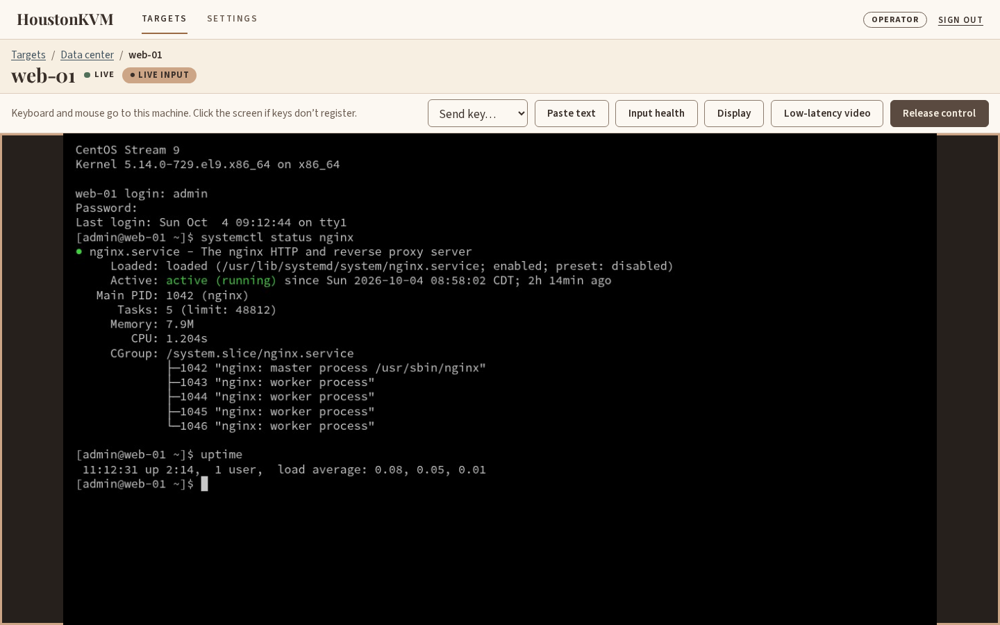
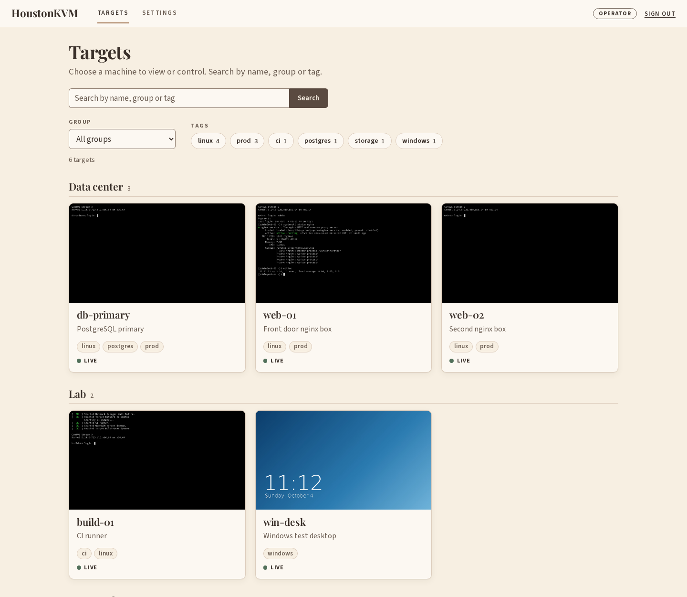
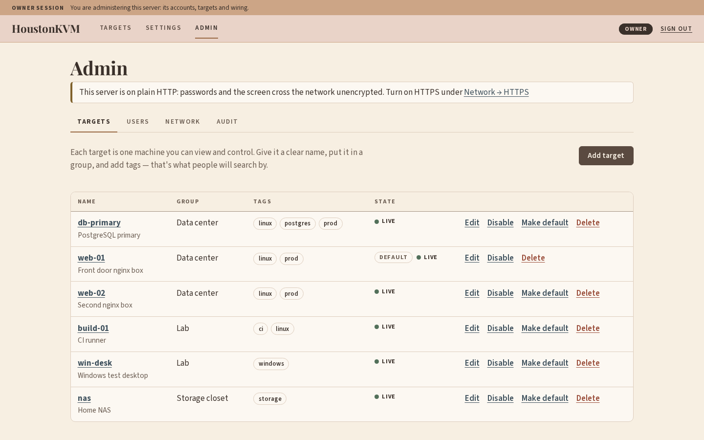
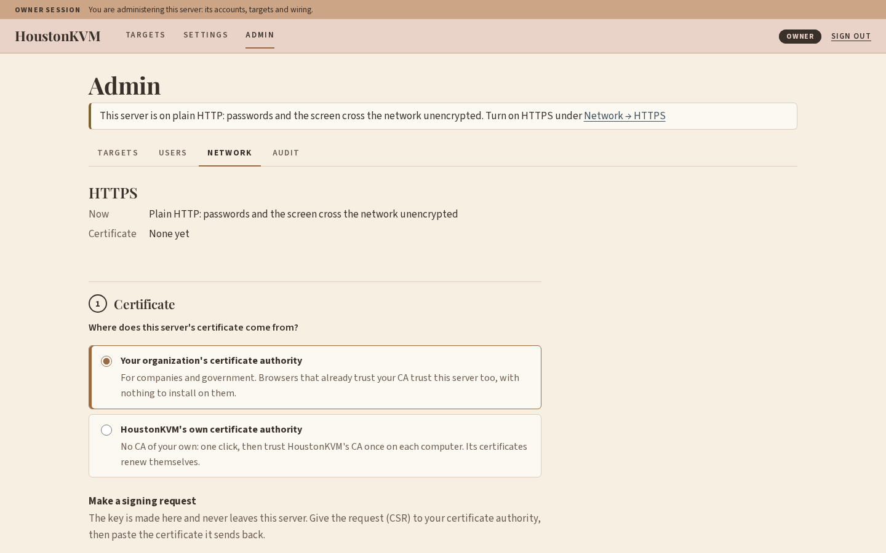
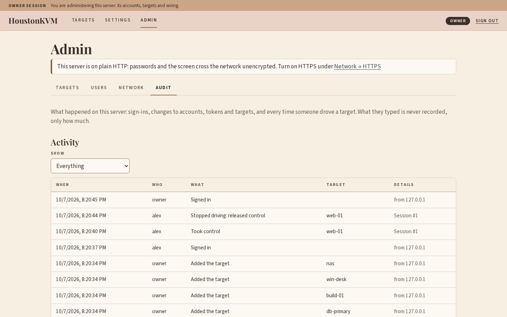

# HoustonKVM

HoustonKVM is a self-hosted IP-KVM. Plug a cheap HDMI capture dongle and a CH9329
keyboard/mouse adapter into a machine, run HoustonKVM on a spare box next to it, and
see its screen and drive it from a web browser, from the login screen onward.



Got some spare compute lying around and wish it did something useful? Now it can.
Why Houston? Because Houston is only as big as you make it (do you live inside or
outside the Loop?).

The same goes here. How many machines do you want to reach? One, two, a dozen? Group
them together and reach them all from one address instead of bookmarking a dozen
IPs. The only limit is your appetite for cheap capture dongles and **CH9329**
serial-to-USB adapters.

Ever shown a friend something cool over a KVM session, only for them to click
something by accident? That's why there are roles: Viewers watch, Operators drive
(only one at a time per machine), and Owners administer.

Tired of juggling heavy web front-ends? This one is plain HTML, CSS and JavaScript,
built right into the executable, with no framework to keep up with.

Like to automate things? Anything you can do in the web UI, you can do through the
[API](docs/API.md).

## Screenshots

| | |
|---|---|
|  |  |
| **The directory:** every machine, by group, searchable by name or tag. | **Admin → Targets:** what each target is wired to, and its state. |
|  |  |
| **Admin → Network → HTTPS:** a certificate from your CA or HoustonKVM's own. | **Admin → Audit:** who signed in, and who drove which machine. |

## What you need

| | |
|---|---|
| **A server** | Linux with a C++20 toolchain to build. Developed and tested on x86-64 CentOS Stream 9. Other distros and ARM boards should work but have not been tested. |
| **Video in** | At least one capture device that Linux exposes through V4L2 and that offers **MJPEG**, which most USB HDMI capture dongles do (`v4l2-ctl --list-formats-ext` will tell you). |
| **Sound (optional)** | Most HDMI capture dongles are also a USB sound card carrying the machine's sound. HoustonKVM finds it on its own, and viewers hear it with low-latency video once they unmute. |
| **Keyboard and mouse out** | At least one **CH9329** serial-to-USB-HID adapter plugged into the target (I bought mine on eBay, but you can solder your own). |

## Install

### As an RPM (CentOS Stream 9/10 and relatives)

The build needs the EPEL and CRB repositories. Low-latency H.264 video also needs
Cisco's OpenH264 build from the `epel-cisco-openh264` repository on the machine that
runs the server. Without it the server still works, with MJPEG video only.

```console
$ sudo dnf install -y epel-release rpm-build
$ sudo dnf config-manager --set-enabled crb epel-cisco-openh264
$ sudo dnf builddep -y houstonkvm.spec
$ bash scripts/fetch-rpm-sources.sh          # the only step that needs the network
$ rpmbuild -ba houstonkvm.spec
$ sudo dnf install ~/rpmbuild/RPMS/*/houstonkvm-[0-9]*.rpm
$ sudo systemctl enable --now houstonkvm
```

The RPM installs a locked-down systemd service (running as its own `houstonkvm`
user), and keeps its database in `/var/lib/houstonkvm/`. If you will use the USB
gadget backend, also `sudo systemctl enable --now houstonkvm-hid`.

### From source

```console
$ scripts/setup-centos9.sh                   # build dependencies into /usr/local
$ cmake -B build -S . && cmake --build build -j"$(nproc)"
$ ./build/HoustonKVM --port=8080             # try it: keeps houstonkvm.db in the current directory
$ sudo bash scripts/install.sh               # or install it as a service
```

`scripts/setup-centos9.sh` is also the readable reference for what the build needs
on another distribution: GCC 11 or newer, CMake, SQLite, OpenSSL, libsodium,
libjpeg-turbo, OpenH264, alsa-lib, Opus, zlib and nlohmann/json from the system, plus uSockets,
uWebSockets and libdatachannel, which the script builds from upstream (the RPM
pins each one to an exact release). If you stage those somewhere other than `/usr/local`, point CMake at them
with `-DHOUSTONKVM_DEPS_PREFIX=<dir>`.

### First run

1. Open `http://<server>:8080/` and create the Owner account. The form asks for a
   one-time **setup code** that the server prints to its log when it starts with no
   accounts (`journalctl -u houstonkvm`, or the terminal it runs in), so someone who
   reaches the port before you can't claim the server.
2. Go to **Admin → Targets → Add target**. Pick the capture device and how keyboard
   and mouse reach the machine, and give it a name, a group and tags. Devices that
   are plugged in are offered in a list, and ones already used by another target are
   marked.
3. Add accounts under **Admin → Users**. **An Owner cannot drive a target**: taking
   control needs an **Operator** account, so that administering the server and
   piloting a machine stay separate.
4. Open the target from the directory, press **Take control**, and click the screen.

A fresh install starts with a placeholder "Default target". Edit or delete it when
you add your own.

The server listens on TCP 8080 by default (`--port`), and on 8443 once HTTPS is
on. Low-latency WebRTC video uses UDP 50000–50100, so open those too if a firewall
is in the way. The RPM ships a firewalld service covering all three, but does not
open anything by itself:
`sudo firewall-cmd --permanent --add-service=houstonkvm && sudo firewall-cmd --reload`.
If SELinux stops the service binding a non-default port, allow it with
`sudo semanage port -a -t http_port_t -p tcp <port>`.

HoustonKVM makes no connections out of your network by itself. Low-latency video
uses no STUN or TURN server unless an Owner adds one under **Admin → Network**,
and on a LAN or VPN it doesn't need one. To fix the list in the server's
configuration instead, use `--ice-server` (see `HoustonKVM --help`).

## Security: READ THIS

Security is your responsibility. HoustonKVM gives whoever controls it
**full keyboard and mouse control of a real machine**

- **Turn on HTTPS.** HoustonKVM starts on plain HTTP, and Admin says so until you
  change it. Under **Admin → Network → HTTPS** an Owner first gets a certificate:
  from the organization's own CA with a signing request (the key never leaves the
  server) or by uploading one, or from HoustonKVM's own small certificate authority
  (trust it once, in browsers or by GPO or Ansible, and the certificate renews
  itself). Then they turn HTTPS on. No restart. The
  switch only sticks once a browser reaches the HTTPS address, so a blocked port
  or a refused certificate puts the server back on plain HTTP after two minutes.
  Open 8443/tcp too (the `houstonkvm` firewalld service covers it).
  - **Locked out anyway?** Add `--tls=off` to `/etc/houstonkvm/houstonkvm.conf` and
    restart. That turns HTTPS off, and it stays off when you remove the option
    again, so fix things in Admin over plain HTTP and turn HTTPS on there.
  - **Fleets:** `--tls=on` and a certificate in `/etc/houstonkvm/tls/` fix HTTPS in
    the configuration instead, and `systemctl reload houstonkvm` picks up a
    renewed certificate without dropping anyone. See `man houstonkvm` and the
    [examples](docs/examples/) (an Ansible playbook and certbot hooks).
  - The system's crypto policy decides TLS versions and ciphers, and certificates
    are made with OpenSSL's FIPS-compatible interface.
- **Or put a reverse proxy in front.** Start the server with
  `--bind=127.0.0.1 --tls=off --secure-cookies --trusted-proxy=127.0.0.1` so only
  the proxy can reach it, and make the proxy pass the browser's `Host` header and
  WebSocket upgrades, add `X-Forwarded-For`, and not buffer the video streams.
  Video over WebRTC travels straight to the server over UDP and does not go
  through the proxy. MJPEG video does, and a viewer on a slow link can fall
  further behind than without the proxy: frames the server would skip for them sit
  in the proxy's buffers instead. For nginx (`tests/integration/test_reverse_proxy.py`
  runs this block as written):

  ```nginx
  location / {
      proxy_pass http://127.0.0.1:8080;
      proxy_http_version 1.1;
      proxy_set_header Host $http_host;
      proxy_set_header X-Forwarded-For $proxy_add_x_forwarded_for;
      proxy_set_header Upgrade $http_upgrade;
      proxy_set_header Connection "upgrade";
      proxy_buffering off;
  }
  ```

- **Never expose HoustonKVM to the open Internet.** Always keep it on a trusted network or behind a VPN.
- **Sign-in is rate limited per source address**, five failures locking that address
  out for five minutes. Behind a proxy, name it with `--trusted-proxy` so each
  visitor's own address (from `X-Forwarded-For`) is the one counted; otherwise every
  visitor shares the proxy's address and one person's typos lock everyone out.
- **Requests that use the session cookie must come from the server's own page.** A
  page on another site, or on another port of the same host, can't drive a target
  with your cookie: the server checks the browser's `Origin` against the `Host`
  header. If your proxy rewrites `Host`, tell the server its public address with
  `--allowed-origin=https://kvm.example.com`. The UI also ships a strict
  Content-Security-Policy, so it runs no script but its own files.
- **There is no two-factor sign-in yet.**
- **There is an audit log** (Admin → Audit, or the [API](docs/API.md#audit-log)):
  sign-ins, account, token and target changes, and every time someone drove a
  target: who, from where, for how long, and how many keys and mouse events they
  sent. **Never what they typed**, so passwords typed into a target don't end up
  in the log. Only Owners can read it. Records are kept for 90 days
  (`--audit-retention-days`).
- **API tokens** can do at most what the account that made them can. Give each
  one only what it needs: a `read` token can't drive a target or change
  anything, and a `metrics` token can only read `/metrics`. Tokens expire after
  90 days unless you choose otherwise. Revoke ones you don't use.

To report a vulnerability, see [SECURITY.md](SECURITY.md).

## Hardware and compatibility

The goal is to work with as many CH9329 adapters and capture dongles as possible.
The CH9329 path is exercised against real hardware. Capture support is the
generic V4L2/MJPEG path, so a UVC device that offers MJPEG should work.

**If you try a device, please tell us how it went** by opening an issue with the
model, its USB ID (`lsusb`), the output of `v4l2-ctl --list-formats-ext` for a
capture device, and what worked or didn't.

## Documentation

- [docs/API.md](docs/API.md): the HTTP API, with examples.
- [CHANGELOG.md](CHANGELOG.md): what changed in each release.
- [CONTRIBUTING.md](CONTRIBUTING.md): building, testing and sending changes.
- [THIRD_PARTY_NOTICES.md](THIRD_PARTY_NOTICES.md): what HoustonKVM is built from.

## Contributing

Bug reports, hardware reports and pull requests are welcome. See
[CONTRIBUTING.md](CONTRIBUTING.md). The short version: run the tests
(`scripts/run-tests.sh`), and sign off your commits.

## License

HoustonKVM is licensed under the [Apache License 2.0](LICENSE). The libraries it is
built from keep their own licenses, listed in [THIRD_PARTY_NOTICES.md](THIRD_PARTY_NOTICES.md).

The web interface has no third-party framework or design system — it's
hand-written HTML, CSS and JavaScript over native browser controls. Its two
fonts (Playfair Display and Source Sans 3, both OFL-1.1) are served by
HoustonKVM itself, so the UI never reaches out to the internet.
