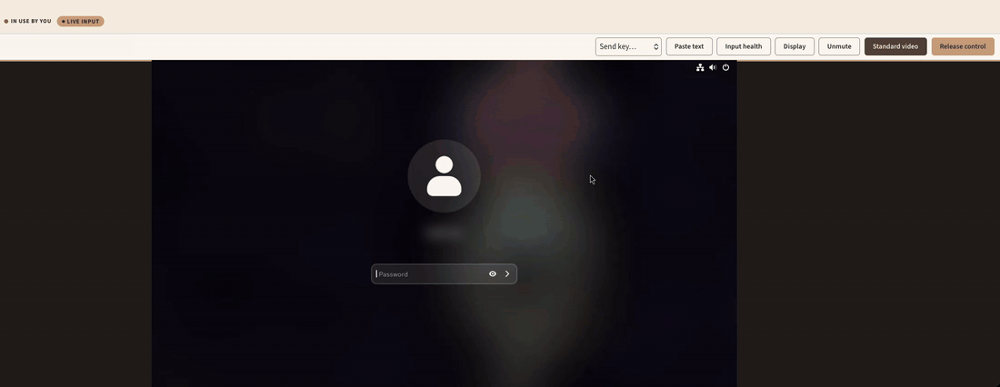

# HoustonKVM

**Turn your old hardware into an IP-KVM, and drive as many machines as your CPU and bandwidth allow.**



- **One address, many targets.** Each machine needs only a USB HDMI capture
  dongle and a CH9329 keyboard/mouse adapter. Group them, tag them, and search
  them all under one shareable address.
- **Made for collaboration.** Viewers can watch, one operator drives each
  session, and viewers can't bump the operator off the mouse. Actions are
  auditable; keystrokes are not.
- **Small and self-contained.** MB sized binary with the web UI built in,
  built-in HTTPS, no cloud and no outbound connections, and an
  [API](docs/API.md) for everything the UI does. Apache-2.0.

## Quick start

**Per machine you need** a USB HDMI capture dongle that offers MJPEG (most do)
and a CH9329 serial-to-USB keyboard/mouse adapter. Most dongles carry sound too.

On CentOS Stream, RHEL, AlmaLinux or Rocky Linux 9 or 10 (x86_64):

```console
$ sudo dnf install -y epel-release
$ sudo dnf config-manager --set-enabled crb
$ sudo dnf config-manager --add-repo https://researchcookie.github.io/houstonkvm-rpms/houstonkvm.repo
$ sudo dnf install houstonkvm
$ sudo systemctl enable --now houstonkvm
$ sudo firewall-cmd --permanent --add-service=houstonkvm && sudo firewall-cmd --reload
```

Open `http://<server>:8080/`, create the Owner account with the one-time setup
code from `journalctl -u houstonkvm`, and add your machines under **Admin →
Targets**. Building from source, firewall ports and the full first run are in
[docs/install.md](docs/install.md).

## Security: read this

HoustonKVM gives whoever controls it **full keyboard and mouse control of real
machines**, so:

- **Never expose it to the open Internet.** Keep it on a trusted network or
  behind a VPN.
- **Turn on HTTPS** under **Admin → Network → HTTPS** (no restart), or put it
  behind a reverse proxy.
- Sign-in is rate limited, and cookie requests must come from HoustonKVM's own
  page. There is **no two-factor sign-in yet**.
- The audit log records who drove which machine and for how long, **never what
  they typed**.

Details, proxy setup and API token scopes: [docs/security.md](docs/security.md).
To report a vulnerability, see [SECURITY.md](SECURITY.md).

## Screenshots

| | |
|---|---|
|  |  |
| **The directory:** every machine, by group, searchable by name or tag. | **Admin → Targets:** what each target is wired to, and its state. |
|  |  |
| **Admin → Network → HTTPS:** a certificate from your CA or HoustonKVM's own. | **Admin → Audit:** who signed in, and who drove which machine. |

## Documentation

- [docs/install.md](docs/install.md): installing, building from source, first run, hardware.
- [docs/security.md](docs/security.md): HTTPS, reverse proxies, sign-in, the audit log, tokens.
- [docs/API.md](docs/API.md): the HTTP API, with examples.
- [CHANGELOG.md](CHANGELOG.md): what changed in each release.
- [CONTRIBUTING.md](CONTRIBUTING.md): building, testing and sending changes.
- [THIRD_PARTY_NOTICES.md](THIRD_PARTY_NOTICES.md): what HoustonKVM is built from.

## Contributing

Bug reports, hardware reports and pull requests are welcome. See
[CONTRIBUTING.md](CONTRIBUTING.md). The short version: run the tests
(`scripts/run-tests.sh`), and sign off your commits.

## License

HoustonKVM is licensed under the [Apache License 2.0](LICENSE). The libraries it is
built from keep their own licenses, listed in [THIRD_PARTY_NOTICES.md](THIRD_PARTY_NOTICES.md).

The web interface has no third-party framework or design system — it's
hand-written HTML, CSS and JavaScript over native browser controls. Its two
fonts (Playfair Display and Source Sans 3, both OFL-1.1) are served by
HoustonKVM itself, so the UI never reaches out to the Internet.
